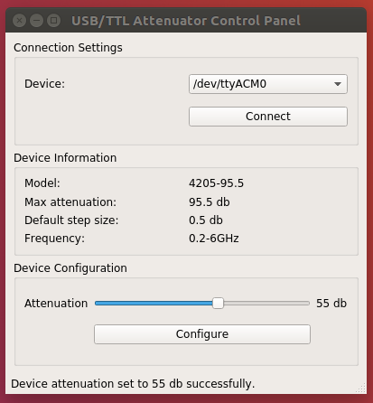
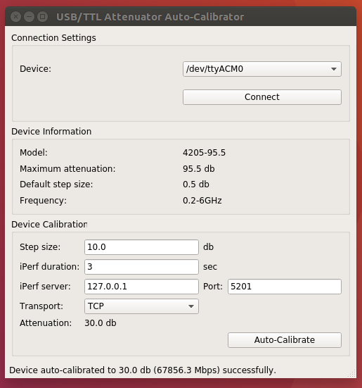

# About

## AttnCtl
AttnCtl is a PyQt5-based control-panel for 4205 series of USB/TTL family of programmable attenuators.

## AutoCal
AutoCal is a PyQt5-based auto-calibrator for the 4205 series of USB/TTL family of programmable attenuators.

### Software Requirements
AutoCal expects the following software packages to be installed:

* python iperf3 (pip2 install iperf3)
* libiperf-dev (apt-get install libiperf-dev)
